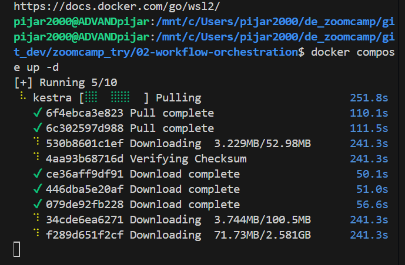
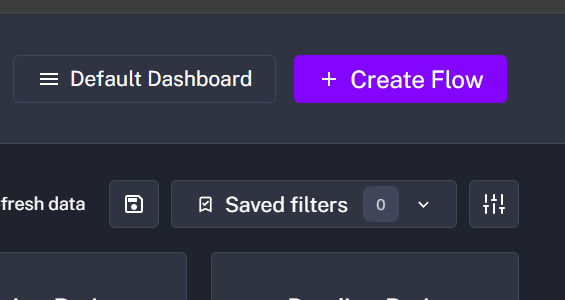

# Homework 2

By Pijar HM

This is my method to solve homework, the answer is not provided here, my answer provided only in zoomcamp homework submit form

### Question 1

#### Installing Kestra

- Run this

```bash
cd 02-workflow-orchestration
docker compose up -d
```



Kestra will be pulled in docker, based on docker yaml the we can acces on

- Keep in mind that this kestra also insttalling postgres on port 5432 of your pc

- If you want access the database, but your port 5432 is not empty (for example you have postgres installed on 5432, you should move it to another port) for me it's like this

```yaml
pgdatabase:
  image: postgres:18
  environment:
    POSTGRES_USER: root
    POSTGRES_PASSWORD: root
    POSTGRES_DB: ny_taxi
  ports:
    - "5442:5432" # host port 5442 → container port 5432
```

- Then, you can access in your localhost port of 5442 in dbeaver od pgadmin with database name `ny_taxi`

- After you done with your kestra set-up you shoul ingest the remaining data of `ny_taxi` from 2019 to 2021, you can modified the flow corresponding to your needs

- the flow name is `05_postgres_taxi.yaml` load the yaml to flow managament with create flow



- paste the code to flow code

- the important part for backfill is here

```yaml
variables:
  file: "{{inputs.taxi}}_tripdata_{{trigger.date | date('yyyy-MM')}}.csv"
  staging_table: "public.{{inputs.taxi}}_tripdata_staging"
  table: "public.{{inputs.taxi}}_tripdata"
  data: "{{outputs.extract.outputFiles[inputs.taxi ~ '_tripdata_' ~ (trigger.date | date('yyyy-MM')) ~ '.csv']}}"
```

- You will backfill (it means load the data from exact periode of time to one another), clict trigger then click backfill, fill it to 2019 to 2021

- 

## Question 2

What is the rendered value of the variable file when the inputs taxi is set to `green`, year is set to `2020`, and month is set to `04` during execution?

- We should remember that in flow code `04_postgres_taxi.yaml` there is line

```yaml
variables:
  file: "{{inputs.taxi}}_tripdata_{{inputs.year}}-{{inputs.month}}.csv" # this one
  staging_table: "public.{{inputs.taxi}}_tripdata_staging"
  table: "public.{{inputs.taxi}}_tripdata"
  data: "{{outputs.extract.outputFiles[inputs.taxi ~ '_tripdata_' ~ inputs.year ~ '-' ~ inputs.month ~ '.csv']}}"
```

- the keys is that will be three variable, taxi type, year, and month

## Question 3

How many rows are there for the Yellow Taxi data for all CSV files in the year 2020?

- After you ingest the corresponding period, you can open dbeaver or pgadmin, connect to `ny_taxi` database and run a query to count row for respecting time, there's lot of method to count you can make, but the simplest way is like this

```sql
SELECT COUNT(*) AS total_rows
FROM yellow_tripdata
WHERE EXTRACT(YEAR FROM tpep_pickup_datetime) = 2020;
```

## Question 4

How many rows are there for the Green Taxi data for all CSV files in the year 2020?

- It's the same for question 3 but the table should be different

```sql
SELECT COUNT(*) AS total_rows
FROM green_tripdata
WHERE EXTRACT(YEAR FROM tpep_pickup_datetime) = 2020;
```

## Question 5

How many rows are there for the Yellow Taxi data for the March 2021 CSV file?

- careful the sql query is strict about datetime, makesure you include time from 00:00 to 23:59

```sql
SELECT COUNT(*) AS total_rows
FROM yellow_tripdata
WHERE tpep_pickup_datetime >= '2021-03-01 00:00:00'
  AND tpep_pickup_datetime < '2021-04-01 00:00:00';
```

## Question 6

How would you configure the timezone to New York in a Schedule trigger?

- The timezone trigger would be placed here in flow code

```yaml
triggers:
  - id: green_schedule
    type: io.kestra.plugin.core.trigger.Schedule
    cron: "0 9 1 * *"
    timezone: # Here you will input the timezone
    inputs:
      taxi: green

  - id: yellow_schedule
    type: io.kestra.plugin.core.trigger.Schedule
    cron: "0 10 1 * *"
    timezone: # Here you will input the timezone
    inputs:
      taxi: yellow
```

- You can look at documentation here

https://kestra.io/docs/workflow-components/triggers/schedule-trigger
